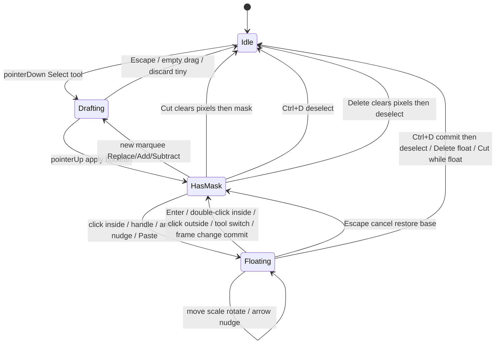

# 01 — Lifecycle & state model

## Цель

Зафиксировать **модель данных** и **конечный автомат** выделения: от Idle до Deselect / commit float. Без этой модели нельзя однозначно реализовать rect/ellipse/lasso, boolean, transform и clipboard.

## Источники платформ (поведение)

- Aseprite: selection = mask; transforms применяются к **active cel**; marching ants; boolean Replace/Union/Subtract/Intersect.  
  Источник: [Aseprite Selecting](https://aseprite.org/docs/selecting/), [Move Selection](https://aseprite.com/docs/move-selection/).
- Photoshop: selection isolates pixels for edit/copy/transform; Free Transform commit/cancel; New/Add/Subtract/Intersect в options bar.  
  Источник: [Select with marquee tools](https://helpx.adobe.com/photoshop/using/selecting-marquee-tools.html), [Free Transform](https://helpx.adobe.com/photoshop/using/free-transformations-images-shapes-paths.html).
- Внутреннее представление маски как 1-bit/pixel (selected / not) описано во вторичном обзоре Aseprite Selection Tools (mintlify wiki, раздел Selection Implementation).  
  Источник (secondary): [Selection Tools — mintlify wiki](https://mintlify.wiki/aseprite/aseprite/tools/selection).  
  **Warning:** тот же wiki ошибочно описывает некоторые modifiers (см. [`12`](./12-sources-and-product-decisions.md)); для boolean/modifiers предпочитать [Selecting](https://aseprite.org/docs/selecting/) и [Keyboard Shortcuts](https://aseprite.com/docs/keyboard-shortcuts/).

## Терминология (обязательная)

| Термин | Значение |
|--------|----------|
| `selectionMask` | Документная бинарная маска выделения; `null` = Idle (нет ants) |
| `selectionDraft` | Live geometry пока pointer down (ещё не boolean-committed) |
| `floatSession` | Floating pixels + transform после cut-out / paste |
| `selectionOpMode` | **Sticky** UI mode из flyout (`replace` / `add` / `subtract`); переживает stroke |
| **Sticky mode** | Значение `selectionOpMode` между штрихами; modifiers его не меняют |
| **Effective mode** | Mode одного stroke: sticky, временно overridden Shift→Add / Alt→Subtract на `pointerDown` |
| HasMask / Drafting / Floating / Idle | Состояния state machine ниже |

Не смешивать: «Shift square/circle» — geometry constraint, не boolean Add. См. [`02`](./02-rectangular-marquee.md) / [`05`](./05-boolean-modes.md).

## Продуктовая модель данных (v1)

Document-level (не per-layer):

| Поле | Тип | Смысл |
|------|-----|--------|
| `selectionMask` | `Uint8Array \| null` | Бинарная маска `W×H` (0/1), размер = canvas (`160×160`) |
| `selectionOpMode` | `"replace" \| "add" \| "subtract"` | Sticky UI mode; modifier на pointerDown → effective override |
| `selectionDraft` | object \| null | Live preview пока pointer down (rect/ellipse/lasso path) |
| `floatSession` | object \| null | Floating pixels после cut-out / paste |
| `selectionClipboard` | object \| null | Internal clipboard (не system clipboard v1) |

### `selectionDraft` (минимальный контракт)

```ts
type SelectionDraft =
  | { kind: "rect"; x0: number; y0: number; x1: number; y1: number; constrainSquare: boolean; fromCenter?: boolean; nudgeDx?: number; nudgeDy?: number }
  | { kind: "ellipse"; x0: number; y0: number; x1: number; y1: number; constrainCircle: boolean; fromCenter?: boolean; nudgeDx?: number; nudgeDy?: number }
  | { kind: "lasso"; points: Array<{ x: number; y: number }> };
```

Координаты — **integer document pixels** (после hit-test через viewport → canvas). Zoom влияет только на hit-testing (см. [`10-overlay-hit-testing.md`](./10-overlay-hit-testing.md)).

### `floatSession`

```ts
type FloatSession = {
  pixels: Uint8ClampedArray; // RGBA buffer of float bbox
  mask: Uint8Array;          // same size as pixels footprint, or full-canvas — выбрать один контракт в коде
  transform: { x: number; y: number; w: number; h: number; rotation: number };
  baseLayerSnapshot: Uint8ClampedArray; // layer before cut-out, для Escape cancel
  sourceLayerId: string;
  sourceFrameId: string;
};
```

### `selectionClipboard`

```ts
type SelectionClipboard = {
  pixels: Uint8ClampedArray;
  mask: Uint8Array;
  width: number;
  height: number;
};
```

Соответствует идее Aseprite Cut/Copy/Paste selection content ([Edit menu](https://aseprite.com/docs/edit-menu/)) и Photoshop Copy/Paste selection ([Copy and paste selections](https://helpx.adobe.com/photoshop/desktop/make-selections/refine-modify-selections/copy-and-paste-selections.html)), но **v1 не пишет в OS clipboard** (продуктовое ограничение плана).

## State machine



### Sticky mode persistence

`selectionOpMode` — session / store lifetime; resets to Replace on new/close document; not disk-persisted unless tool prefs later gain persist ([`05`](./05-boolean-modes.md), [`12`](./12-sources-and-product-decisions.md)).

### Состояния — семантика

| State | `selectionMask` | `selectionDraft` | `floatSession` | UI |
|-------|-----------------|------------------|----------------|-----|
| Idle | null | null | null | Нет ants |
| Drafting | previous or null | non-null | null (float должен быть committed before new draft — см. ниже) | Live outline |
| HasMask | non-empty | null | null | Marching ants + handles |
| Floating | pre-float mask retained until commit; overlay tracks `floatSession.transform` | null | non-null | Float pixels + handles |

**Cut ≠ float:** Cut → clipboard + clear pixels + clear mask → Idle (см. [`07`](./07-clipboard-cut-copy-paste-delete.md)). Float входят Move/scale/rotate handles и Paste.

**Инвариант:** не начинать новый draft, пока `floatSession != null`, без auto-commit. Источник поведения commit: Photoshop Free Transform — смена tool / click outside / Enter commits ([Free Transform](https://helpx.adobe.com/photoshop/using/free-transformations-images-shapes-paths.html)). Aseprite: click outside selection commits multi-cel transform preview ([Transformations](https://aseprite.org/docs/transformations/)).

## Жизненный цикл — happy path (общий)

Каждый shape-tool файл (02–04) обязан покрывать ту же цепочку локально:

1. **Activation** — Select tool + под-инструмент (`rect` / `ellipse` / `lasso`) в flyout.
2. **Sticky mode** — `selectionOpMode` = Replace (default) или Add/Subtract из flyout.
3. **pointerDown** — resolve modifiers → **effective mode**; `beginSelectionDraft` (если был float → сначала `commitFloat`).
4. **pointerMove** — `updateSelectionDraft` (live preview; Space reposition **REQUIRED** for rect/ellipse drafts — [`12`](./12-sources-and-product-decisions.md)).
5. **pointerUp** — rasterize draft → boolean с текущей маской → `selectionMask`; draft = null.
6. **Refine** — повторные штрихи Add/Subtract/Replace ([`05`](./05-boolean-modes.md)).
7. **Transform / clipboard** — float move/scale/rotate ([`06`](./06-floating-transform.md)); Ctrl+C/X/V, Delete ([`07`](./07-clipboard-cut-copy-paste-delete.md)).
8. **Exit** — Enter commit float; Esc cancel draft/float; Ctrl+D deselect; click-outside policy ([`08`](./08-select-all-deselect-exit.md)).

Пустая маска после любой операции → Idle (`selectionMask = null`).

## Pointer phases (обязательные)

| Phase | Действие store |
|-------|----------------|
| pointerDown | resolve modifiers → **effective** op mode (sticky + Shift/Alt); begin draft OR begin float transform OR deselect-on-outside |
| pointerMove | update draft / update float transform |
| pointerUp | commit draft boolean OR end float drag (float остаётся до Enter/click-outside/tool switch) |
| pointerCancel / blur / Escape | cancel draft; cancel float restore (Esc **не** deselect) |

## Undo policy (продукт)

- Изменения **пикселей слоя** (cut-out stamp, delete, cut, paste commit) → `pushLayerUndo` **один раз на commit**, не на каждый drag.
- Изменения **маски** (новый rect, add, subtract, deselect) → **не** в undo v1 (known gap, как в плане).
- Пока `floatSession != null`: Ctrl+Z → `cancelFloat` only (restore base + original mask), **без** pop undo stack ([`06`](./06-floating-transform.md), [`12`](./12-sources-and-product-decisions.md)).
- После Ctrl+Z слоя (когда не floating): не оставлять orphan float поверх restored pixels.

Обоснование разделения: mask ops в нашем плане явно вынесены из undo (**PRODUCT**). Photoshop History обычно включает selection changes — мы **не** копируем History model Photoshop в v1. Не утверждать детали Aseprite undo-of-mask без официального URL.

## Active layer / frame scope

Aseprite: «When you make a selection, you are selecting the active cel, so all transformation will be made to that specific cel only» ([Selecting](https://aseprite.org/docs/selecting/)).

Наш контракт:

- **Mask** — document-level (одна маска на документ).
- **Pixel ops** (float extract/stamp, delete, cut) — только **active layer + active frame**.
- Смена layer/frame при открытом float → **auto-commit** float на *исходный* layer/frame, затем переключить контекст (см. edge matrix).

## Locked / hidden layer

Продукт (план):

- Mask edit (draft/boolean/deselect/select all) — **разрешён**.
- Float start / cut / delete / paste stamp — **no-op** (toast optional).

Это отличается от полного block editing в Photoshop locked layers; зафиксировано явно как product rule.

## Animation play

Пока animation playing — block selection pointer mutations (draft/float/clipboard mutating ops). Deselect hotkey может оставаться (безопасный clear). Детали — [`11-edge-cases-matrix.md`](./11-edge-cases-matrix.md).

## Store actions (целевой API)

Из плана:

`beginSelectionDraft`, `updateSelectionDraft`, `commitSelectionDraft`, `deselect`, `selectAll`, `startFloatFromSelection`, `updateFloatTransform`, `commitFloat`, `cancelFloat`, `copySelection`, `cutSelection`, `pasteClipboard`, `deleteSelection`.

Каждый action обязан уважать state machine выше.

## Acceptance для этой модели

- [ ] Нельзя иметь одновременно non-null `selectionDraft` и `floatSession`
- [ ] Empty mask после любой операции → `selectionMask = null` (не пустой массив «навсегда»)
- [ ] Commit float всегда stamps на `sourceLayerId/sourceFrameId` сессии
- [ ] Escape draft ≠ Escape float (разные restore paths)
